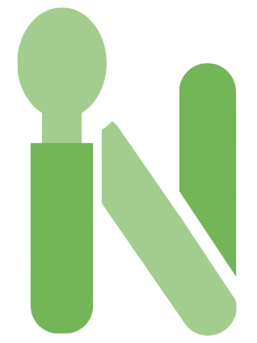

#  Landing Page - Nutr.IA

<div align="center">
  
  <br>
  <br>
  <p>
    <b>Repositório oficial do site institucional do projeto Nutr.IA.</b>
  </p>
  <p>
    <i>"Menos dúvidas, mais resultados."</i>
  </p>
</div>

---

##  Sobre este Repositório

Este projeto contém o código-fonte da **Landing Page** desenvolvida para apresentar a startup **Nutr.IA**. O site serve como o principal meio informativo, detalhando a missão, os valores e as funcionalidades do aplicativo planejado.

O desenvolvimento deste portal web foi realizado como parte do Trabalho de Conclusão de Curso (TCC) pelos alunos do **3ºA da Etec de Taboão da Serra (2025)**.

##  Estrutura do Site

A Landing Page foi projetada para oferecer uma experiência fluida e informativa, dividida nas seguintes seções principais:

* **Home:** Apresentação impactante do aplicativo com chamadas para download (mockup).
* **Recursos:** Exibição das principais funcionalidades do app (IA, lista de compras, gamificação).
* **Depoimentos:** Área de prova social com relatos de usuários.
* **Planos:** Comparativo entre o plano Gratuito e o Nutr.IA+.
* **FAQ:** Seção interativa de perguntas frequentes.
* **Saiba Mais (Sobre Nós):** Uma página dedicada à história do projeto, missão, visão, valores e apresentação da equipe.

##  Sobre o Projeto Nutr.IA (O Produto)

Embora este repositório trate do site, o objetivo dele é divulgar o **Nutr.IA**, uma solução tecnológica para democratizar o acesso à nutrição.

**O que o site divulga:**
*  **Personalização via IA:** Planos alimentares adaptados ao orçamento e preferências do usuário.
*  **Gestão Inteligente:** Listas de compras automáticas e scanner de produtos.
*  **Gamificação:** Sistema de recompensas reais por hábitos saudáveis.
*  **Comunidade:** Interação social e suporte mútuo entre usuários.

##  Tecnologias Utilizadas

O site foi construído utilizando tecnologias web fundamentais para garantir desempenho e responsividade:

* **HTML5:** Estruturação semântica do conteúdo.
* **CSS3:** Estilização avançada, uso de Flexbox/Grid e design responsivo.
* **JavaScript:** Interatividade, animações de scroll (`scroll-animation`) e manipulação do DOM (ex: botão "Voltar ao Topo" e FAQ).

##  Equipe de Desenvolvimento

| Integrante | Função no Projeto | LinkedIn |
| :--- | :--- | :--- |
| **Henrique Ávila Ferreira** | Full Stack &#124; DBA | [](https://www.linkedin.com/in/henriqueferreira06/) |
| **Camilly Queiroz (Damasceno)** | Designer &#124; Front-end | [](https://www.linkedin.com/in/camilly-queiroz-ba9644288/) |
| **Cauê Pereira das Dores** | Front-end &#124; QA Tester | [](https://www.linkedin.com/in/caue-dores-222b62381/) |
| **Filipe Guandalino** | Full Stack | [](https://www.linkedin.com/in/filipe-guandalino-375281382/) |
| **João Pedro Nakazoni** | DBA &#124; Gerente Financeiro | [](https://www.linkedin.com/in/jo%C3%A3o-pedro-campos-silva-nakazoni-52014b382/) |

##  Como Executar Localmente

1.  Clone este repositório:
    ```bash
    git clone [https://github.com/henriqueferreira06/landing-page-nutria.git](https://github.com/henriqueferreira06/landing-page-nutria.git)
    ```
2.  Abra o arquivo `index.html` em seu navegador de preferência.

---

<div align="center">
  <p>Desenvolvido pela equipe Nutr.IA © 2025</p>
  <p>Etec de Taboão da Serra</p>
</div>
